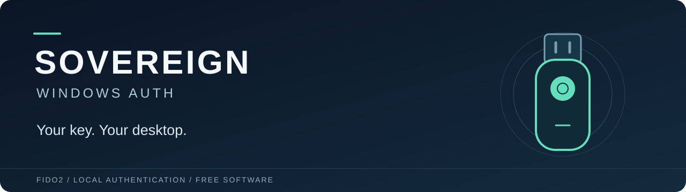
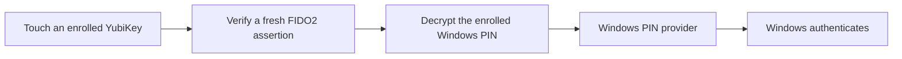

<p align="center">
  
</p>

<p align="center">
  <a href="https://github.com/VrtxOmega/sovereign-windows-auth/actions/workflows/windows.yml?query=branch%3Amain"></a>
  <a href="LICENSE"></a>
  <a href="docs/VALIDATION.md"></a>
</p>

<p align="center">
  <a href="docs/SETUP.md">Get started</a> ·
  <a href="docs/RECOVERY.md">Recovery</a> ·
  <a href="docs/VALIDATION.md">Test results</a> ·
  <a href="docs/README.md">Documentation</a> ·
  <a href="CONTRIBUTING.md">Contribute</a>
</p>

**Unlock your Windows desktop with a YubiKey touch. Free software, licensed under GPLv3.**

Sovereign adds a **Sovereign key** option to the Windows sign-in screen. Select
**Sign in**, touch either enrolled YubiKey, and enter your desktop. Daily use
requires no password, PIN or one-time code entry.

Built for a personal Microsoft-account PC with an existing Windows Hello PIN.
Authentication runs locally, including offline: no Entra tenant, authentication
server, subscription or activation service is required.

> **Project status:** experimental source preview. Two physical YubiKeys have
> passed desktop unlock, offline use, sleep/resume and separate restart tests on
> one Windows 11 Pro x64 build 26200 PC. Both also passed lock/unlock with ordinary
> PIN/password options hidden. The restart tests preceded that restriction.
> There is no signed end-user installer or independent security audit yet.
> [Read the validation record →](docs/VALIDATION.md)

## What you get

- **Two independent keys.** Either enrolled YubiKey can unlock the same account.
- **Local authentication.** A fresh, signed FIDO2 assertion authorizes each unlock.
- **Protected enrollment.** Each key independently encrypts the Windows PIN;
  machine-bound protection and restricted file permissions protect the profile.
- **Optional key requirement.** A separate filter can hide identified ordinary
  sign-in options after recovery is prepared and tested.
- **Paired USB recovery.** A bootable recovery screen can restore normal PIN
  sign-in while preserving the existing PIN and YubiKey enrollments.
- **Open development.** GPL-3.0-only source, documented boundaries and public CI.
  Existing browser passkeys and YubiKey configuration are preserved.

## Choose your sign-in setup

| Setup | Everyday sign-in | Recovery |
| --- | --- | --- |
| Default installation | Sovereign key alongside ordinary Windows options | Select your existing Windows PIN |
| Optional desktop restriction | Identified PIN/password/biometric alternatives are hidden | Boot the paired recovery USB to restore normal PIN sign-in |

The restriction is an explicit, separate installation step. Building the project
does not install either component or change Windows sign-in.

## Get started

You need Windows x64, two YubiKeys with FIDO2 `hmac-secret`, an existing numerical
Windows Hello PIN on a personal Microsoft account, and the Windows C++ build
tools. Other account types and hardware combinations need additional work.

Start with [developer setup](docs/SETUP.md). It walks through building, enrolling
both keys, verifying Windows authentication and installing the provider. Read
[recovery](docs/RECOVERY.md) before registering a sign-in component.

To inspect and build the source without changing sign-in:

```powershell
git clone https://github.com/VrtxOmega/sovereign-windows-auth.git
cd sovereign-windows-auth
./tools/fetch-dependencies.ps1
./tools/check-source.ps1
./tools/build.ps1 -WithVmFilter -WithDesktopFilter
```

The full build runs ten native test suites. Enrollment and installation remain
separate manual steps. See [prerequisites and script-policy guidance](docs/SETUP.md#prerequisites).

## How it works



The key's `hmac-secret` protects an encrypted copy of your existing Windows Hello
PIN. Sovereign decrypts it after a valid touch and supplies it to Windows' own PIN
provider. The PIN remains part of Windows authentication; you do not type it
during daily use.

Touch confirms possession and presence, not a fingerprint or a second factor.
The desktop restriction controls sign-in choices; disk encryption, remote access
and application authentication are separate concerns. The PIN bridge also uses
Windows interfaces outside the public SDK, so Windows updates need compatibility
testing. [Security model](docs/SECURITY_MODEL.md) · [Architecture](docs/ARCHITECTURE.md)

## Help build it

Compatibility reports, security review, accessible enrollment, safe PIN changes
and individual-key revocation are priorities. See the [roadmap](docs/ROADMAP.md)
and [contribution guide](CONTRIBUTING.md).

Use [GitHub issues](https://github.com/VrtxOmega/sovereign-windows-auth/issues/new/choose)
for bugs and compatibility reports. Report vulnerabilities through the
[private security channel](https://github.com/VrtxOmega/sovereign-windows-auth/security/advisories/new).

## License and credits

Copyright © 2026 VrtxOmega and contributors. [GNU GPL version 3 only](LICENSE).
Recipients can inspect, modify and redistribute the software under that license;
covered distributed derivatives must provide corresponding source.

Built with Yubico's FIDO libraries and Windows credential-provider interfaces.
See [third-party attribution](THIRD_PARTY.md) and our
[YubiKey FIDO2 Linux authentication project](https://github.com/VrtxOmega/yubikey-fido2-linux-auth).
Independent software; not endorsed by Microsoft or Yubico.
