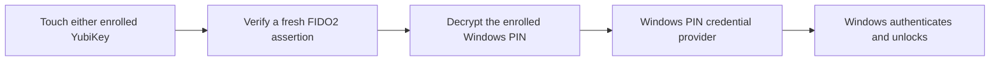

# Sovereign Windows Auth

**Unlock your Windows desktop with a YubiKey touch. Free software, licensed under GPLv3.**

Sovereign adds a native **Sovereign key** option to the Windows sign-in screen.
Either enrolled key can unlock the same account independently. Daily use is:
select **Sign in**, touch the key, and enter your desktop. Your ordinary Windows
PIN remains available for recovery.

**Experimental, with actual desktop unlock verified on Windows 11 Pro x64 build
26200 using two physical YubiKeys.** This is a source release for developers and
careful testing. Both keys also passed offline unlock, sleep/resume and first
sign-in after separate restarts. Additional PCs and Windows versions still need
validation. There is no signed end-user installer yet.

## How it works

During enrollment, Sovereign encrypts your existing Windows Hello PIN separately
for each YubiKey. A fresh FIDO2 assertion with a physical touch releases the key's
`hmac-secret`; Sovereign uses it to decrypt the enrolled PIN and passes that PIN
privately to Windows' own PIN credential provider. Windows performs the login.
You do not type the PIN during daily use.

This makes the key an alternative way to unlock an existing Windows credential.
It is not a native Microsoft-account passkey login, and the PIN still exists in
encrypted form on the PC. See the [security model](docs/SECURITY_MODEL.md) before
installing. A person holding an enrolled key and this PC can use that key to
unlock it; touch confirms presence, not identity.

- Independent enrollment for two YubiKeys, with no daily PIN, OTP or password entry.
- Fresh signed challenges and AES-256-GCM encryption bound to the account and key.
- Machine-bound DPAPI protection and restricted permissions on enrollment files.
- Cancellation, expiry and single-use handling for a completed authentication.
- Existing passkeys, YubiKey configuration and Windows PIN recovery are preserved.
- No activation server, subscription, license-key check or project telemetry.

## Build, enroll and recover

Start with the [developer setup guide](docs/SETUP.md). It covers prerequisites,
building, hardware enrollment, both-key verification, installation and the first
lock-screen test. Setup requires administrator access and one-time credential
entry in local prompts. It currently supports enrollment for a personal Microsoft
account with an existing numerical Windows Hello PIN.

Read [recovery instructions](docs/RECOVERY.md) before registering the provider.
The installer preserves the stock Windows sign-in providers. Historical update
helpers are not part of a fresh installation.

## Validation and development

The [validation record](docs/VALIDATION.md) distinguishes actual hardware and
lock-screen results from automated checks. The initial working implementation is
preserved by the `prototype-2026-09-05` Git tag.

Four native automated suites cover cryptography/profile parsing, the credential
provider contract, Windows credential serialization and an isolated filter
experiment. The [key-required design](docs/KEY_REQUIRED_DESIGN.md) explains that
experiment and its remaining recovery requirements. CI builds and runs the suites
without enrolling hardware or registering a sign-in provider. Hardware and real
lock-screen tests remain manual.

Contributions are welcome, especially compatibility testing, review of the PIN
bridge, key revocation and safe enrollment updates. See [CONTRIBUTING.md](CONTRIBUTING.md)
and [SECURITY.md](SECURITY.md). The bridge uses Windows callback interfaces absent
from the public SDK, so Windows updates are a known compatibility boundary.

## License and acknowledgments

Copyright (C) 2026 VrtxOmega and contributors. [GNU GPL version 3 only](LICENSE).
We distribute this project at no charge. GPLv3 preserves recipients' rights to
inspect, modify and redistribute it, including corresponding source for covered
derivatives. It permits commercial use; it is not a ban on charging for copies.

Built on Windows credential-provider APIs and Yubico's FIDO libraries. See
[third-party notices and references](THIRD_PARTY.md). Inspired by our
[YubiKey FIDO2 Linux authentication work](https://github.com/VrtxOmega/yubikey-fido2-linux-auth).
This is an independent project, not endorsed by Microsoft or Yubico.
